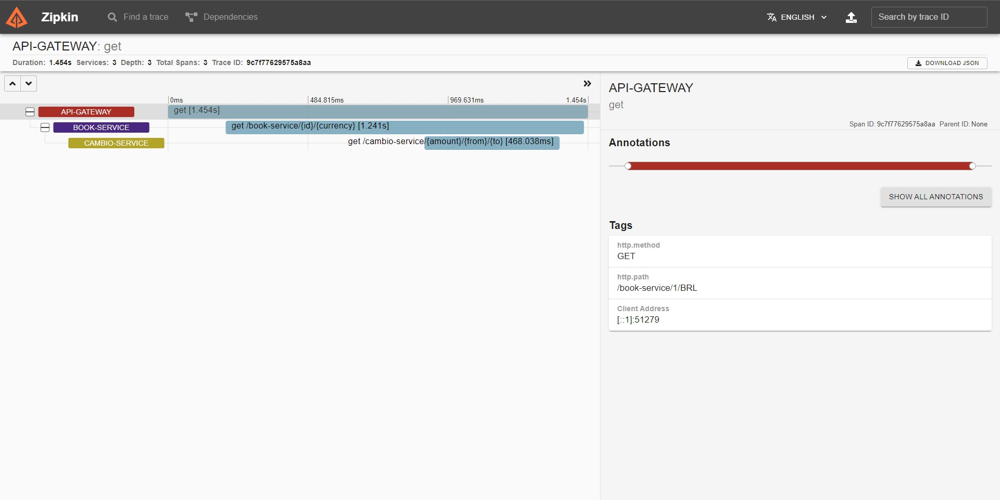

<h1 align="center">
  SC Microservices
</h1>

<p align="center">
  <a href="#routes">Routes</a>&nbsp;&nbsp;|&nbsp;&nbsp;
  <a href="#documentation">Documentation</a>&nbsp;&nbsp;|&nbsp;&nbsp;
  <a href="#technologies">Technologies</a>&nbsp;&nbsp;|&nbsp;&nbsp;
  <a href="#building">Building</a>&nbsp;&nbsp;|&nbsp;&nbsp;
  <a href="#docker">Docker</a>&nbsp;&nbsp;|&nbsp;&nbsp;
  <a href="#contributing">Contributing</a>
</p>


## Routes
| Method | URL                                                                       | Description              |
|--------|---------------------------------------------------------------------------|--------------------------|
| GET    | http://localhost:8765/cambio-service/{amount}/{currencyFrom}/{currencyTo} | Get cambio from currency |
| GET    | http://localhost:8765/book-service/{bookID}/{currencyTo}                  | Get book from ID         |
| GET    | http://localhost:8761                                                     | Eureka Server UI         |
| GET    | http://localhost:9411                                                     | Zipkin                   |
| GET    | http://localhost:15672/                                                   | RabbitMQ Management      |

## Documentation
### Eureka


### Zipkin



### Swagger Docs


| URL                                                                          | Description                    |
|------------------------------------------------------------------------------|--------------------------------|
| http://localhost:8765/swagger-ui.html                                        | Visual Documentation           |
| http://localhost:8765/v3/api-docs                                            | Api Documentation              |


## Technologies
This project was developed using the following technologies:
- [Spring Boot](https://spring.io/)
- [Spring Data JPA](https://spring.io/projects/spring-data-jpa)
- [Spring Boot Actuator]()
- [Spring Cloud Config Server]()
- [Spring Cloud Config Client]()
- [Spring Cloud Netflix Eureka Server]()
- [Spring Cloud Netflix Eureka Client]()
- [Spring Cloud Circuit Breaker - Resilience4j]()
- [Spring Cloud Openfeign]()
- [Spring Cloud Sleuth]()
- [Spring Rabbit]()
- [Springdoc Open Api](https://springdoc.org/)
- [Zipkin]()
- [Flyway](https://flywaydb.org/)
- [MYSQL](https://www.mysql.com/)


## Building
You'll need [Java 11+](https://www.oracle.com/br/java/technologies/javase-jdk11-downloads.html) and [Maven](https://maven.apache.org/download.cgi) installed on your computer in order to build this app.
```bash
$ git clone https://github.com/eric-souzams/sc-microservices.git
$ cd sc-microservices

$ cd {service-name}
$ mvn spring-boot:run

order to UP: naming-server -> api-gateway -> cambio-service -> book->service 
```


## Docker
You'll need [Docker](https://www.docker.com/) installed on your computer in order to build this app.
```bash
$ git clone https://github.com/eric-souzams/sc-microservices.git
$ cd sc-microservices
$ docker-compose up
```


## Contributing
This repository is currently under development. If you want to contribute please fork the repository and get your hands dirty, and make the changes as you'd like and submit the Pull request.